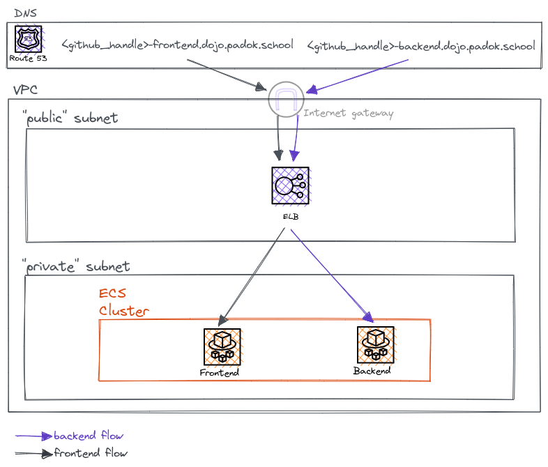

# Dojo Terraform

In this dojo, you will learn Terraform basics, how to use the language and how to organize your codebase to make it easly understannable and maintanable.

For the purpose of the dojo we will deploy a classic AWS infrastructure to expose a mini website on Internet. In order to make it simplier for you, we already set up some parts of the infrastructure and you have a dedicated Virtual Machine with all the tools and rights you need.

**Target Infrastructure**

---

## Usefull documentation

Those documentations could be usefull for the rest of the dojo. Don't be afraid to ask questions and search on internet too.

- [Terraform documentation](https://www.terraform.io/)
- [Tfswitch](https://tfswitch.warrensbox.com/Install/)
- [AWS Terraform provider](https://registry.terraform.io/providers/hashicorp/aws/latest)
- [AWS admin console]()
- [Visual Studio Code](https://code.visualstudio.com/)

## Step 0 - I set up my toolbox

#### Acceptance Criterias
- [ ] I have [Visual Studio Code](https://code.visualstudio.com/) installed with [ssh-remote](https://marketplace.visualstudio.com/items?itemName=ms-vscode-remote.remote-ssh) installed
- [ ] I can connect to my remote VM at `<github_handle>@<github_handle>.dojo.padok.school`
- [ ] I can open the repository [dojo-terraform](https://github.com/padok-team/dojo-terraform) on VS Code
- [ ] I can show my installed terraform version

#### Technical Comments
- Download & install [Visual Studio Code](https://code.visualstudio.com/download)
- Install `remote - ssh` extension for VSCode
- Connect through `ssh-remote`to `<github_handle>@<github_handle>.dojo.padok.school`
- Find `dojo-terraform/exercices` folder repository in your home directory
- Explore your repository!! :D
- Use `tfswitch` command to install the accurate terraform version
- Find your first `terraform` CLI command to show the current version in use

  
 Hint n°1

  Have you  read the Getting Started `terraform` documentation?

  
 Hint n°2

  Tfswitch will use `.tfswitchrc` file in your repository...

 

Know that you are all set up,you are ready to deploy your application with Terraform on an AWS infrastructure!

  
 What did you learn? 

  <ul>
    <li>Use tfswitch to change your terraform version</li>
    <li>Terraform CLI can be used in your console</li>
    <li>(optional) - VSCode is awsome </li>
  </ul>

 

## Step 1 - I Have DNS records for my application

In this exercice, you will deploy a DNS record to make a public endpoint for your future web application.
In the meantime you will learn how to make a basic configuration for terraform.
We will have two endpoints:
- `<github_handle>-frontend.dojo.padok.school`
- `<github_handle>-backend.dojo.padok.school`

### A - I can deploy a terraform resource

#### Acceptance Criterias
- [ ] I have a DNS record `<github_handle>-app.dojo.padok.school` in my DNS Hosted Zone
- [ ] I can make a `terraform apply` on my `app` folder
- [ ] I have a local terraform `state` with all my deployed resources described in it

#### Technical Comments
Configuration:
- In `app`, create a `_settings.tf` file
- Based on [AWS provider documentation](https://registry.terraform.io/providers/hashicorp/aws/latest), configure `terraform` and `provider` blocks with
  - `>= 4.0.0` required provider version
  - `eu-west-3` region
  - `default` profile
  - `default_tags`
    - ManagedByTF = "true"
    - User = "<github_handle>"

DNS:
- Create a file `dns.tf` and use the resource `aws_route53_record`
- You want to deploy the endpoint `<github_handle>-app.dojo.padok.school`
- Zone ID and record list are given by your profesor
- we deploy a CNAME record

Deployment:
- Using your `terraform` CLI in VSCode console
- and based on [Terraform documentation](https://www.terraform.io/)
- Init your terraform configuration
- Deploy your configuration
- See your DNS record in AWS Console in Route 53 > Hosted zones - `dojo.padok.school`
- Take a look at the `.tfstate` file created on your `app` folder

  
 Hint n°1

  Have you seen the `Use Provider` toggle on the documentation?

  
 Hint n°2

  Have you take a look at the aws_route53_record resource documentation? It seems like some parameters are required...

  
 Hint n°3

  Maybe try a `terraform init`, `terraform plan`, `terraform apply` commands?

 
At this point, your `terraform` configuration is set and you can deploy new resources and change existing ones. But Don't some informations are hardcoded in your code, don't you think?

### B - I keep my codebase DRY

#### Acceptance Criterias
- [ ] My terraform code does not have external resources hardecoded configuration
- [ ] I have two DNS records for
  - `<github_handle>-frontend.dojo.padok.school`
  - `<github_handle>-backend.dojo.padok.school`

#### Technical Comments

Data:
- Based on [AWS provider documentation](https://registry.terraform.io/providers/hashicorp/aws/latest), use a `aws_route53_hosted_zone` data to refer an existing hosted zone named `dojo.padok.school`
- Do the same for an `aws_elb` resource named "padok-dojo-lb"
- Refer those data in your record resource

Locals:
- Create a new file `locals.tf`
- Add a new local `applications` that is a map of empty object named "frontend" and "backend"
- Iterate on this map to create two distinct records
  - `<github_handle>-frontend.dojo.padok.school`
  - `<github_handle>-backend.dojo.padok.school`
- re-deploy your infrastructure

  
 Hint n°1

  Be carefull! `resources` and `data` are not the same but they are refered with the same name!

  
 Hint n°2

  Resources & Data blocks expose some outputs you can use.

  
 Hint n°3

  Resources & Data blocks expose some outputs you can use.

  
 Hint n°4

  Your Terraform plan will destroy some resources, that's not a problem.

At this point, you deployed two dns records for your application, each one pointing on the same Elastic Load Balancer instance.
Now let's deploy our web application! :D

  
 What did you learn? 

  <ul>
    <li>Configure a terraform provider</li>
    <li>Deploy a resource</li>
    <li>Destroy a resource</li>
    <li>Use data to get remote resoures informations</li>
    <li>Use locals to avoid repetition in code</li>
    <li>Iterate on your resources</li>
  </ul>

## Step 2 - I deploy my application

### A - My load balancer targets my
