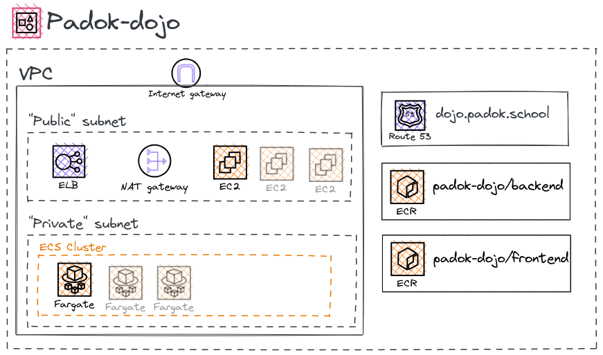

# Dojo terraform setup



## Requirements

Install the following tools:
- [direnv](https://direnv.net/docs/installation.html)
- [aws cli](https://docs.aws.amazon.com/cli/latest/userguide/getting-started-install.html)
- [tfswitch](https://tfswitch.warrensbox.com/Install/)
- [tgswitch](https://tgswitch.warrensbox.com/)

Be assure you have following roles on AWS accounts:
- padok - *PadokSSO*
- padok_lab - *AdministratorAccess*
- padok_dojo - *AdministratorAccess*

If not, You can ask to the padok aws team.

## Installation

1. In `setup/layers/vm/module.hcl`, set `github_usernames` parameter with accurate list of github handles.

2. Run the following commands.
```bash
# From repository root folder
tfswitch
tgswitch

cd ./setup/layers

# Allow direnv to use .envrc
direnv allow

# Login to AWS through Padok SSO
aws sso login

terragrunt run-all apply
```

## Infrastructure details

This repository will deploy an AWS infrastructure designed for the Dojo in `padok_dojo` account.
The principal resources deployed are:
- A VPC
- A Route 53 hosted zone `dojo.padok.school`
- An ECS Cluster with an Elastic Load balancer
- Two ECR for backend and frontend application
- A tunned virtual machine for each student with every cli and tools they will need

## Destroy the infrastructure

- Run the following commands:
```bash
# Download aws-nuke cli
wget -c https://github.com/rebuy-de/aws-nuke/releases/download/v2.22.1/aws-nuke-v2.22.1-linux-amd64.tar.gz -O - | tar -xz -C $HOME/bin

# Create an alias for padok-dojo account
aws iam create-account-alias --profile padok_dojo --account-alias padok-dojo

# Destroy all resources in aws account
aws-nuke -c ./nuke-config.yaml --profile padok_dojo --no-dry-run
```

- Connect to `padok_lab` account to delete `dojo.padok.school` NS record


## Feedbacks about previous Dojo(s)

*User Access:*
/!\ This is a pain point for each dojo /!\
- Anticipate `github account` and `rsa ssh key pair` creations
- Get the list of `github handles`

*Basic infrastructure understanding:*

We tried to abstract at maximum the complexity of AWS (iam, resources, security...) to focus exclusivly on `terraform`.
But some basic informations to share may be helpful to make your users understand better:
- Docker image / registry
- DNS zone / record
- Load balancer target group / listener rules
- ECS cluster / services

*Supporting students:*
- Do the first exercice together to be sure everyone understand the basics
